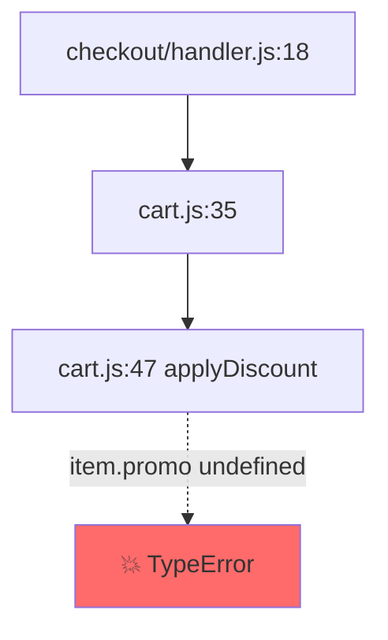

# 📍 Pinpoint

> **Claude can't debug. Pinpoint makes it actually trace.**

A Claude Code plugin that runs a disciplined 6-phase root-cause methodology before any fix is suggested. Diagnosis-first, with `--fix` as opt-in.

<!-- replace with a recorded GIF: failing test → /trace → trace report appears -->


## Why

Asking Claude to "fix this bug" usually pattern-matches against the symptom and proposes a plausible-looking change. The actual cause stays hidden. Pinpoint forces a 6-phase trace — Anchor → Hypotheses → Backward trace → Invariant check → Witness → Pinpoint — before any code is touched. The methodology is what vanilla AI debugging skips.

## Install

```bash
# In Claude Code:
/plugin marketplace add YOUR_GH_USERNAME/pinpoint
/plugin install pinpoint
```

## Use

```text
/trace "TypeError: undefined is not a function at cart.js:47"
/trace https://github.com/owner/repo/issues/123
/trace --fix "the cart total is wrong on Fridays"
/trace --bench
```

You get back a structured **Trace Report**: anchor, ruled-out hypotheses, a Mermaid call-flow diagram, a backward trace table, a concrete witness, and the exact `file:line` of the root cause. Patches are not written unless you say `--fix`.

## Demo

Try it in 30 seconds: clone [pinpoint-demo](https://github.com/YOUR_GH_USERNAME/pinpoint-demo), open it in Claude Code, run `/trace` on any of the seeded bugs.

## The methodology

1. **Anchor** — convert the symptom to a precise `file:line`.
2. **Hypotheses** — list ≥3 candidate causes before tracing.
3. **Backward trace** — walk data and control flow back from the anchor.
4. **Invariant check** — find the first place reality diverges from intent.
5. **Witness** — produce a concrete input + path that reproduces the bad state.
6. **Pinpoint** — name the cause; rule out every other hypothesis explicitly.

## Example trace report

```markdown
# 📍 Pinpoint Trace Report

**Symptom:** TypeError: undefined is not a function
**Anchor:** src/cart.js:47 — applyDiscount(item.promo)
**Root cause:** src/cart.js:42 — item.promo undefined for pre-migration items
**Confidence:** high

## Hypotheses considered
1. ✅ Pre-migration items lack `promo` field — confirmed
2. ❌ Race condition during cart load — ruled out, no concurrency
3. ❌ Type definition wrong — ruled out, runtime issue, not type

## Call flow


## Backward trace
| Step | Location | Tracking | Note |
|------|----------|----------|------|
| 1 | cart.js:47 | item.promo | undefined at call site |
| 2 | cart.js:42 | item | from lineItems[i] |
| 3 | cart.js:35 | lineItems | hydrated from DB row, no fallback |

## Witness
For a cart row inserted before 2025-09-01, `lineItems[i].promo === undefined`; reaching cart.js:47 invokes `undefined(...)` → TypeError.

## Fix surface
- src/cart.js:42 — guard `item.promo` before passing
```

## Benchmark

Reproducible accuracy harness in `bench/`. Fixtures are real-world bug patterns (off-by-one, mutable defaults, async races, type assertions, closures, etc.) across Python and TypeScript.

```bash
python bench/runner.py --all --out bench/results/latest.json
```

See [bench/README.md](bench/README.md) for fixture format and how to add your own.

## FAQ

**Does it modify my code?** Only if you pass `--fix`. The default flow is diagnose → review → fix.

**What languages are supported?** v0.1.0 has language-specific tooling for **Python** and **TypeScript / JavaScript**. The methodology runs on every language via `Read` + `Grep` + tree-sitter.

**Does it run my code?** No. v0.1.0 is strictly static. The plugin reads code; it does not execute it or run tests.

**Does it call the API?** It runs through your existing Claude Code session — no separate API key. The benchmark runner shells out to the `claude` CLI.

**Where do trace reports go?** Saved to `.pinpoint/traces/` in your repo. Add it to `.gitignore` if you don't want them tracked.

## Roadmap

- v0.1.0 (this release): core trace, --fix, --bench, GitHub issue ingest, 10 fixtures, Python + TypeScript tooling
- v0.2.0: Rust + Go tooling, auto-regression-test on `--fix`, expanded fixture set, before/after comparison docs

## License

MIT — see [LICENSE](LICENSE).
