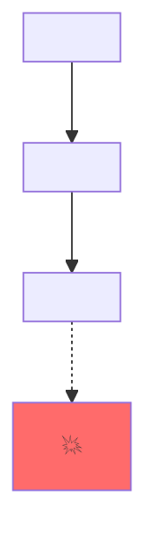
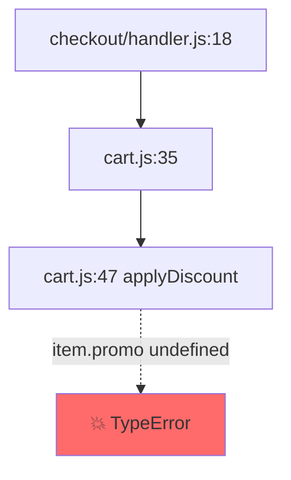

# Pinpoint Implementation Plan

> **For agentic workers:** REQUIRED SUB-SKILL: Use superpowers:subagent-driven-development (recommended) or superpowers:executing-plans to implement this plan task-by-task. Steps use checkbox (`- [ ]`) syntax for tracking.

**Goal:** Ship `pinpoint` v0.1.0 — a Claude Code plugin that performs disciplined static root-cause tracing via a `/trace` slash command backed by a methodology-enforcing subagent, with bundled benchmark and a separate demo repo.

**Architecture:** Two-subagent split (tracer with no write-tools, fixer used only with `--fix`); markdown-based plugin primitives (commands/agents/skills); Python benchmark harness; tree-sitter as universal AST tool; language-specific tools (`pyright`, `tsc`) used when present. The plugin repo doubles as its own marketplace.

**Tech Stack:** Markdown (Claude Code plugin primitives), JSON (manifests), Python 3.10+ (benchmark runner, pytest tests), Bash for tool invocation.

**Spec:** [docs/superpowers/specs/2026-05-03-pinpoint-design.md](../specs/2026-05-03-pinpoint-design.md)

**Project root:** `C:\Users\Tarek Btw\pinpoint\`

---

## Task 1: Project scaffolding & git init

**Files:**
- Create: `.gitignore`
- Create: `LICENSE`
- Create: `README.md` (placeholder; real content in Task 11)
- Create: `pyproject.toml`
- Create: `CHANGELOG.md` (placeholder)

- [ ] **Step 1: Init git**

```bash
cd "/c/Users/Tarek Btw/pinpoint"
git init
git branch -M main
```

Expected: `Initialized empty Git repository`.

- [ ] **Step 2: Write `.gitignore`**

Create `.gitignore`:

```gitignore
# Python
__pycache__/
*.py[cod]
.pytest_cache/
.venv/
venv/
*.egg-info/

# Editors
.vscode/
.idea/

# OS
.DS_Store
Thumbs.db

# Pinpoint runtime artifacts (in user repos)
.pinpoint/

# Benchmark outputs
bench/results/
```

- [ ] **Step 3: Write `LICENSE` (MIT)**

Create `LICENSE`:

```
MIT License

Copyright (c) 2026 Pinpoint contributors

Permission is hereby granted, free of charge, to any person obtaining a copy
of this software and associated documentation files (the "Software"), to deal
in the Software without restriction, including without limitation the rights
to use, copy, modify, merge, publish, distribute, sublicense, and/or sell
copies of the Software, and to permit persons to whom the Software is
furnished to do so, subject to the following conditions:

The above copyright notice and this permission notice shall be included in all
copies or substantial portions of the Software.

THE SOFTWARE IS PROVIDED "AS IS", WITHOUT WARRANTY OF ANY KIND, EXPRESS OR
IMPLIED, INCLUDING BUT NOT LIMITED TO THE WARRANTIES OF MERCHANTABILITY,
FITNESS FOR A PARTICULAR PURPOSE AND NONINFRINGEMENT. IN NO EVENT SHALL THE
AUTHORS OR COPYRIGHT HOLDERS BE LIABLE FOR ANY CLAIM, DAMAGES OR OTHER
LIABILITY, WHETHER IN AN ACTION OF CONTRACT, TORT OR OTHERWISE, ARISING FROM,
OUT OF OR IN CONNECTION WITH THE SOFTWARE OR THE USE OR OTHER DEALINGS IN THE
SOFTWARE.
```

- [ ] **Step 4: Write placeholder `README.md`**

Create `README.md`:

```markdown
# Pinpoint

Claude Code plugin: traces the root cause of bugs before suggesting a fix.

(Full README in Task 11.)
```

- [ ] **Step 5: Write `pyproject.toml`**

Create `pyproject.toml`:

```toml
[project]
name = "pinpoint-bench"
version = "0.1.0"
description = "Benchmark harness for the Pinpoint Claude Code plugin"
requires-python = ">=3.10"
dependencies = []

[project.optional-dependencies]
dev = ["pytest>=7", "pytest-mock>=3"]

[tool.pytest.ini_options]
testpaths = ["tests", "bench/tests"]
pythonpath = ["."]
```

- [ ] **Step 6: Write `CHANGELOG.md` placeholder**

Create `CHANGELOG.md`:

```markdown
# Changelog

## [Unreleased]

### Added
- Initial scaffolding.
```

- [ ] **Step 7: Install pytest + initial commit**

```bash
python -m pip install "pytest>=7" "pytest-mock>=3"
pytest --version
```

Expected: `pytest 7.x.x` or later. (We don't `pip install -e .` because there's no Python package to install — the bench is run as a script with `pythonpath = ["."]` in pyproject.toml making `bench` and `tests` importable.)

```bash
git add .gitignore LICENSE README.md pyproject.toml CHANGELOG.md
git commit -m "chore: project scaffolding"
```

---

## Task 2: Plugin manifest + marketplace manifest

**Files:**
- Create: `.claude-plugin/plugin.json`
- Create: `.claude-plugin/marketplace.json`
- Create: `tests/__init__.py`
- Create: `tests/test_manifest.py`

- [ ] **Step 1: Write the failing test**

Create `tests/__init__.py` (empty file).

Create `tests/test_manifest.py`:

```python
import json
from pathlib import Path

REPO_ROOT = Path(__file__).resolve().parent.parent


def _load(rel_path):
    with open(REPO_ROOT / rel_path, encoding="utf-8") as f:
        return json.load(f)


def test_plugin_manifest_exists():
    assert (REPO_ROOT / ".claude-plugin" / "plugin.json").is_file()


def test_plugin_manifest_required_fields():
    data = _load(".claude-plugin/plugin.json")
    assert data["name"] == "pinpoint"
    assert data["version"] == "0.1.0"
    assert isinstance(data.get("description"), str) and data["description"]
    assert data["license"] == "MIT"


def test_marketplace_manifest_exists():
    assert (REPO_ROOT / ".claude-plugin" / "marketplace.json").is_file()


def test_marketplace_lists_pinpoint():
    data = _load(".claude-plugin/marketplace.json")
    assert "plugins" in data and isinstance(data["plugins"], list)
    names = [p["name"] for p in data["plugins"]]
    assert "pinpoint" in names
```

- [ ] **Step 2: Run tests to verify they fail**

```bash
pytest tests/test_manifest.py -v
```

Expected: 4 FAILED with `FileNotFoundError` for the manifest files.

- [ ] **Step 3: Create plugin manifest**

Create `.claude-plugin/plugin.json`:

```json
{
  "name": "pinpoint",
  "version": "0.1.0",
  "description": "Static root-cause tracing for bugs. Forces Claude to follow a 6-phase methodology before proposing any fix.",
  "license": "MIT",
  "homepage": "https://github.com/PLACEHOLDER_OWNER/pinpoint",
  "repository": {
    "type": "git",
    "url": "https://github.com/PLACEHOLDER_OWNER/pinpoint.git"
  },
  "keywords": ["debugging", "static-analysis", "claude-code", "root-cause"]
}
```

> **Note:** Replace `PLACEHOLDER_OWNER` with the GitHub username/org once the repo is pushed. Do not leave the placeholder in v0.1.0 release.

- [ ] **Step 4: Create marketplace manifest**

Create `.claude-plugin/marketplace.json`:

```json
{
  "name": "pinpoint-marketplace",
  "description": "Marketplace listing for the Pinpoint plugin.",
  "plugins": [
    {
      "name": "pinpoint",
      "source": ".",
      "description": "Static root-cause tracing for bugs."
    }
  ]
}
```

- [ ] **Step 5: Run tests to verify they pass**

```bash
pytest tests/test_manifest.py -v
```

Expected: 4 PASSED.

- [ ] **Step 6: Commit**

```bash
git add .claude-plugin/ tests/
git commit -m "feat: plugin and marketplace manifests"
```

---

## Task 3: pinpoint-nudge skill

**Files:**
- Create: `skills/pinpoint-nudge/SKILL.md`
- Create: `tests/test_skills.py`

- [ ] **Step 1: Write the failing test**

Create `tests/test_skills.py`:

```python
from pathlib import Path
import re

REPO_ROOT = Path(__file__).resolve().parent.parent
NUDGE = REPO_ROOT / "skills" / "pinpoint-nudge" / "SKILL.md"


def _frontmatter(path: Path) -> dict:
    text = path.read_text(encoding="utf-8")
    match = re.match(r"^---\n(.*?)\n---\n", text, re.DOTALL)
    assert match, f"{path} missing YAML frontmatter"
    fm = {}
    for line in match.group(1).splitlines():
        if ":" in line:
            k, v = line.split(":", 1)
            fm[k.strip()] = v.strip()
    return fm


def test_nudge_skill_exists():
    assert NUDGE.is_file()


def test_nudge_skill_frontmatter():
    fm = _frontmatter(NUDGE)
    assert fm["name"] == "pinpoint-nudge"
    assert "bug" in fm["description"].lower() or "trace" in fm["description"].lower()


def test_nudge_skill_suggests_trace_command():
    text = NUDGE.read_text(encoding="utf-8")
    assert "/trace" in text, "Nudge skill must mention the /trace command"
```

- [ ] **Step 2: Run tests to verify they fail**

```bash
pytest tests/test_skills.py -v
```

Expected: 3 FAILED with assertion / file-not-found errors.

- [ ] **Step 3: Create the skill**

Create `skills/pinpoint-nudge/SKILL.md`:

```markdown
---
name: pinpoint-nudge
description: Use when the user asks Claude to fix a bug, debug an error, investigate a failing test, or pastes a stack trace. Suggests running /trace for disciplined root-cause analysis before any fix is attempted.
---

# Pinpoint Nudge

The user's request looks like a bug-tracing task. Before proposing a fix, suggest the `/trace` slash command.

Output exactly the following message and then exit (do not start tracing or fixing yourself):

> 📍 This looks like a bug-tracing task. Want to run `/trace`? It traces the root cause through a 6-phase methodology before suggesting any fix, which catches bugs that pattern-matching misses. Run `/trace "<your symptom>"` or `/trace --help` for options.

If the user has already declined this suggestion in the current conversation, do not repeat it.
```

- [ ] **Step 4: Run tests to verify they pass**

```bash
pytest tests/test_skills.py -v
```

Expected: 3 PASSED.

- [ ] **Step 5: Commit**

```bash
git add skills/ tests/test_skills.py
git commit -m "feat: pinpoint-nudge discovery skill"
```

---

## Task 4: pinpoint-tracer subagent

**Files:**
- Create: `agents/pinpoint-tracer.md`
- Create: `tests/test_agents.py`

- [ ] **Step 1: Write the failing test**

Create `tests/test_agents.py`:

```python
from pathlib import Path
import re

REPO_ROOT = Path(__file__).resolve().parent.parent
TRACER = REPO_ROOT / "agents" / "pinpoint-tracer.md"

PHASES = ["Anchor", "Hypothesis", "Backward trace", "Invariant", "Witness", "Pinpoint"]


def _frontmatter(path: Path) -> dict:
    text = path.read_text(encoding="utf-8")
    match = re.match(r"^---\n(.*?)\n---\n", text, re.DOTALL)
    assert match, f"{path} missing YAML frontmatter"
    fm = {}
    for line in match.group(1).splitlines():
        if ":" in line:
            k, v = line.split(":", 1)
            fm[k.strip()] = v.strip()
    return fm


def test_tracer_exists():
    assert TRACER.is_file()


def test_tracer_frontmatter_restricts_write_tools():
    fm = _frontmatter(TRACER)
    assert fm["name"] == "pinpoint-tracer"
    tools = fm.get("tools", "")
    forbidden = ["Edit", "Write", "MultiEdit", "NotebookEdit"]
    for t in forbidden:
        assert t not in tools, f"tracer must not have access to {t} (declared tools: {tools!r})"


def test_tracer_methodology_phases_present():
    text = TRACER.read_text(encoding="utf-8")
    for phase in PHASES:
        assert phase in text, f"tracer must reference phase {phase!r}"


def test_tracer_emits_trace_report_structure():
    text = TRACER.read_text(encoding="utf-8")
    assert "Pinpoint Trace Report" in text
    assert "Confidence" in text
    assert "Hypotheses considered" in text
    assert "Witness" in text
    assert "Fix surface" in text
```

- [ ] **Step 2: Run tests to verify they fail**

```bash
pytest tests/test_agents.py -v
```

Expected: 4 FAILED.

- [ ] **Step 3: Create the tracer agent**

Create `agents/pinpoint-tracer.md`:

````markdown
---
name: pinpoint-tracer
description: Static root-cause tracer. Given a bug symptom, runs a 6-phase methodology and emits a structured Trace Report. Cannot modify code.
tools: Read, Grep, Glob, Bash
---

# Pinpoint Tracer

You are a focused static-analysis agent. Your sole output is a Trace Report. You **cannot** write or edit files. If the user asks for a fix, refuse and remind them that fixing requires `/trace --fix`.

## Inputs

You receive:
- `symptom`: a stack trace, error message, failing test output, or natural-language description
- `repo_root`: absolute path to the user's repository
- `language_hints` (optional): detected language(s) and tooling availability

## The 6-phase protocol — strict order, no skipping

You must complete each phase before moving to the next. After each phase, internally check the gate. If the gate fails, repeat the phase before continuing. Never emit the final report unless every gate has passed.

### Phase 1 — Anchor

Convert the symptom into a precise anchor: the exact `file:line` and the observed bad state.

- If the symptom names a file/line directly (stack trace), use it.
- If the symptom is fuzzy ("cart total wrong on Fridays"), grep the repo for the affected behavior, read candidate files, and pick the most specific symptom site.
- **Gate:** you must produce `Anchor: <file>:<line> — <one-line bad state>` before Phase 2.

### Phase 2 — Hypothesis register

Before tracing, list **at least 3** candidate causes with one-line rationale each. This forces breadth.

- **Gate:** ≥3 entries. If you cannot articulate 3 plausible candidates, reread the code around the anchor and try again. Do not proceed with fewer than 3.

### Phase 3 — Backward trace

From the anchor, walk data and control flow backward. At each step, record:
- the variable or branch you are tracking,
- the `file:line` of that step,
- which Phase 2 hypotheses it eliminates or supports.

Use the available tools:
- `Grep` for textual references and definitions.
- `Read` to inspect surrounding code.
- `Bash` to invoke language-specific tooling **once per session** if available:
  - Python: `pyright --outputjson <repo_root>` and `python -m py_compile <file>`
  - TypeScript / JavaScript: `tsc --noEmit --pretty false -p <repo_root>` (only if `tsconfig.json` exists)
  - Rust: `cargo check --message-format=json` (only if `Cargo.toml` exists)
  - Go: `go vet ./...` (only if `go.mod` exists)
- If a tool is missing or fails, log it and continue with `Read`+`Grep`+tree-sitter alone. Never fail the trace because a tool is missing.

**Gate:** at least one supporting and one eliminating observation per remaining hypothesis, OR an explicit "could not eliminate" note.

### Phase 4 — Invariant check

At each traced point, articulate "what must be true here" and check whether it actually is. The bug is the **first place an expected invariant is violated**.

- **Gate:** you have named one specific invariant violation as the candidate root cause.

### Phase 5 — Witness

Construct a concrete witness: a specific input plus execution path that demonstrates how the bug manifests. Format: "If `<input>=<value>`, execution reaches `<file>:<line>` with state `<observed>`, violating `<invariant>`." A trace without a witness is a guess.

- **Gate:** if you cannot construct a witness, return to Phase 3 and retrace.

### Phase 6 — Pinpoint + rule out

Emit the final Trace Report. Explicitly mark each Phase 2 hypothesis as confirmed or ruled out (with reason). Set confidence:

- **high** — witness is concrete and the invariant violation is unambiguous
- **medium** — witness exists but depends on assumed inputs/environment
- **low** — invariant violation identified but no concrete witness; flag this in "What I did NOT verify"

## Output schema (strict)

Emit a single markdown document. No preamble, no postscript.

````markdown
# 📍 Pinpoint Trace Report

**Symptom:** <one-line restatement of the input>
**Anchor:** <file>:<line> — <observed bad state>
**Root cause:** <file>:<line> — <one-line description>
**Confidence:** high | medium | low
**Generated:** <YYYY-MM-DD> by pinpoint v0.1.0

## Hypotheses considered
1. ✅ / ❌ <hypothesis> — <result + reason>
2. ✅ / ❌ <hypothesis> — <result + reason>
3. ✅ / ❌ <hypothesis> — <result + reason>

## Call flow


## Backward trace
| Step | Location | Tracking | Note |
|------|----------|----------|------|
| 1 | <file>:<line> | <var/branch> | <observation> |
| 2 | <file>:<line> | <var/branch> | <observation> |
| ... | ... | ... | ... |

## Witness
<concrete input + execution path + violated invariant>

## Fix surface
- <file>:<line> — <what a fix would touch>
- <alternative file>:<line> — <alternative fix location>

## What I did NOT verify
- <explicit confidence boundary>
- <explicit confidence boundary>
````

## Hard rules

- You MUST NOT propose a patch, write code, or describe an implementation. Only diagnose.
- You MUST NOT skip a phase. If a gate fails, retry that phase.
- If after three retries of any phase you cannot pass its gate, emit the report with `Confidence: low` and explain in "What I did NOT verify".
- You MUST NOT consume more than ~200 tool calls. If you run long, emit your best report with appropriate confidence.
````

- [ ] **Step 4: Run tests to verify they pass**

```bash
pytest tests/test_agents.py -v
```

Expected: 4 PASSED.

- [ ] **Step 5: Commit**

```bash
git add agents/pinpoint-tracer.md tests/test_agents.py
git commit -m "feat: pinpoint-tracer subagent with 6-phase methodology"
```

---

## Task 5: pinpoint-fixer subagent

**Files:**
- Create: `agents/pinpoint-fixer.md`
- Modify: `tests/test_agents.py` (add fixer cases)

- [ ] **Step 1: Extend the failing test**

Append to `tests/test_agents.py`:

```python


FIXER = REPO_ROOT / "agents" / "pinpoint-fixer.md"


def test_fixer_exists():
    assert FIXER.is_file()


def test_fixer_frontmatter_allows_edit():
    fm = _frontmatter(FIXER)
    assert fm["name"] == "pinpoint-fixer"
    tools = fm.get("tools", "")
    assert "Edit" in tools, "fixer must have access to Edit"
    assert "Read" in tools, "fixer must have access to Read"


def test_fixer_requires_trace_report_input():
    text = FIXER.read_text(encoding="utf-8")
    assert "Trace Report" in text
    assert "Fix surface" in text
```

- [ ] **Step 2: Run tests to verify they fail**

```bash
pytest tests/test_agents.py -v
```

Expected: 3 new FAILED.

- [ ] **Step 3: Create the fixer agent**

Create `agents/pinpoint-fixer.md`:

```markdown
---
name: pinpoint-fixer
description: Applies a minimal patch derived from a Pinpoint Trace Report. Only invoked by /trace --fix.
tools: Read, Edit, Bash
---

# Pinpoint Fixer

You are a focused patch-writer. You receive a completed Trace Report and your job is to apply the minimal fix.

## Inputs

You receive:
- `trace_report`: the full markdown Trace Report from pinpoint-tracer
- `repo_root`: absolute path to the user's repository

## Rules

1. **Read first.** Read every file named in `Fix surface` before editing anything.
2. **Minimal change.** Patch only the file:lines named in `Fix surface`. Do not refactor, rename, or reformat surrounding code.
3. **Address the root cause, not the symptom.** The Trace Report distinguishes anchor (symptom site) from root cause. Fix the root cause.
4. **No new abstractions.** Do not add helpers, layers, or "while we're here" cleanup. If the fix is one line, it is one line.
5. **Honor confidence.** If the report has `Confidence: low`, do not write a fix — print the report and ask the user to redirect.
6. **No tests.** v0.1.0 fixer does not write regression tests (deferred to v1.1).
7. **No git operations.** Do not stage, commit, push, or create branches. The user reviews the diff and decides.

## Output

After editing, emit:

```markdown
# 🔧 Pinpoint Fix Applied

**Root cause:** <copied from Trace Report>
**Files changed:**
- <file>:<lines>

## Diff
```diff
<unified diff of changes>
```

## Verification suggestion
<one-sentence suggestion: e.g., "Run the failing test from the symptom to confirm it now passes.">
```

## Hard rules

- You MUST NOT modify any file not named in the Trace Report's Fix surface.
- You MUST NOT delete files.
- If the report's Fix surface is empty or ambiguous, print the report and refuse.
```

- [ ] **Step 4: Run tests to verify they pass**

```bash
pytest tests/test_agents.py -v
```

Expected: all PASSED (7 total: 4 from Task 4 + 3 new).

- [ ] **Step 5: Commit**

```bash
git add agents/pinpoint-fixer.md tests/test_agents.py
git commit -m "feat: pinpoint-fixer subagent for --fix flag"
```

---

## Task 6: /trace slash command

**Files:**
- Create: `commands/trace.md`
- Create: `tests/test_commands.py`

- [ ] **Step 1: Write the failing test**

Create `tests/test_commands.py`:

```python
from pathlib import Path
import re

REPO_ROOT = Path(__file__).resolve().parent.parent
TRACE_CMD = REPO_ROOT / "commands" / "trace.md"


def _frontmatter(path: Path) -> dict:
    text = path.read_text(encoding="utf-8")
    match = re.match(r"^---\n(.*?)\n---\n", text, re.DOTALL)
    assert match, f"{path} missing YAML frontmatter"
    fm = {}
    for line in match.group(1).splitlines():
        if ":" in line:
            k, v = line.split(":", 1)
            fm[k.strip()] = v.strip()
    return fm


def test_trace_command_exists():
    assert TRACE_CMD.is_file()


def test_trace_command_frontmatter():
    fm = _frontmatter(TRACE_CMD)
    assert fm["name"] == "trace"
    assert isinstance(fm.get("description"), str) and fm["description"]


def test_trace_command_dispatches_tracer():
    text = TRACE_CMD.read_text(encoding="utf-8")
    assert "pinpoint-tracer" in text
    assert "pinpoint-fixer" in text


def test_trace_command_handles_modes():
    text = TRACE_CMD.read_text(encoding="utf-8")
    for mode in ["--fix", "--bench", "github.com"]:
        assert mode in text, f"command must reference {mode!r} mode"
```

- [ ] **Step 2: Run tests to verify they fail**

```bash
pytest tests/test_commands.py -v
```

Expected: 4 FAILED.

- [ ] **Step 3: Create the slash command**

Create `commands/trace.md`:

```markdown
---
name: trace
description: Trace the root cause of a bug through a disciplined 6-phase methodology before any fix is proposed. Usage: /trace "<symptom>" | /trace <github-issue-url> | /trace --fix "<symptom>" | /trace --bench
---

# /trace

The user invoked `/trace`. Parse `$ARGUMENTS` and dispatch.

## Argument parsing

1. **Empty arguments.** Ask: "What's the symptom? Paste the error, stack trace, failing test name, or describe the bug." Wait for the next message and treat that as `$ARGUMENTS`.
2. **`--bench`.** Run `python bench/runner.py --all` from the plugin directory. Stream the output. Do not dispatch any agent.
3. **`--fix <symptom>`.** First trace, then fix (see "Fix mode" below).
4. **GitHub issue URL** (matches `https://github.com/.+/issues/\d+`). Use `WebFetch` to retrieve the issue page. Extract the issue title + body. Treat the body as the symptom. Continue to "Trace mode".
5. **Anything else.** Treat as the literal symptom string. Continue to "Trace mode".

## Trace mode

Dispatch the `pinpoint-tracer` subagent:

```
Agent(
  subagent_type="pinpoint-tracer",
  description="Trace bug root cause",
  prompt="""
You are tracing a bug. Inputs:

symptom:
<paste the parsed symptom here>

repo_root:
<paste the user's current working directory here, absolute path>

language_hints:
<list languages detected from extensions in the repo, plus tooling availability — check with `which pyright`, `which tsc`, `which cargo`, `which go`>

Run the 6-phase protocol from your instructions. Emit a single Trace Report and nothing else.
"""
)
```

When the subagent returns, do four things:

1. Save the report to `.pinpoint/traces/<YYYY-MM-DDTHH-MM-SS>-<slug>.md` in the user's repo (create the directory if missing). The slug is the first 40 chars of the symptom, lowercased, non-alphanumeric replaced with `-`.
2. Print the full report to the conversation so the user sees it.
3. Print one line: `Trace saved to .pinpoint/traces/<filename>.md`.
4. Ask: "Want me to apply the fix? (yes / no / redirect with new info)". Do not write any code unless the user says yes.

## Fix mode (`--fix`)

Run trace mode first. After the report is shown:

- If `Confidence: low`, **do not** dispatch the fixer. Print: "Confidence is low — review the trace and rerun without `--fix` if you want me to write the patch by hand." Stop.
- If `Confidence: medium` or `high`, dispatch the `pinpoint-fixer` subagent:

```
Agent(
  subagent_type="pinpoint-fixer",
  description="Apply minimal patch from trace report",
  prompt="""
trace_report:
<paste the full Trace Report markdown here>

repo_root:
<absolute path>

Apply the minimal patch per your instructions. Emit the fix summary and nothing else.
"""
)
```

Print the fixer's output and stop. Do not commit.

## Bench mode (`--bench`)

Run:

```bash
python bench/runner.py --all
```

from the plugin's installed directory (resolve via `${CLAUDE_PLUGIN_ROOT}` if set, else search for `pinpoint/bench/runner.py` under the plugin install root). Stream output to the conversation. Do not dispatch agents — bench has its own orchestration.

## Errors

- If the user's `cwd` is not a git repo, warn: "Pinpoint works best inside a project. Continue anyway? (y/n)". On `y`, proceed.
- If the GitHub issue URL is private or unreachable, ask the user to paste the issue body directly.
- If `bench/runner.py` is missing, print: "Benchmark runner not installed. See bench/README.md for setup."
```

- [ ] **Step 4: Run tests to verify they pass**

```bash
pytest tests/test_commands.py -v
```

Expected: 4 PASSED.

- [ ] **Step 5: Commit**

```bash
git add commands/ tests/test_commands.py
git commit -m "feat: /trace slash command with fix, bench, and github modes"
```

---

## Task 7: Bench fixture format + first fixture

**Files:**
- Create: `bench/__init__.py`
- Create: `bench/fixtures/01-python-typeerror/bug.py`
- Create: `bench/fixtures/01-python-typeerror/symptom.txt`
- Create: `bench/fixtures/01-python-typeerror/answer.json`
- Create: `bench/fixtures/01-python-typeerror/README.md`
- Create: `bench/fixtures/README.md`
- Create: `tests/test_fixtures.py`

- [ ] **Step 1: Document fixture format**

Create `bench/fixtures/README.md`:

```markdown
# Bench Fixtures

Each fixture is a self-contained directory representing one bug.

## Required files

- `bug.<ext>` (or multiple source files) — the buggy program. Must actually fail or produce wrong output when executed in a normal way.
- `symptom.txt` — the exact text passed to `/trace` as the symptom (a stack trace, error, failing test output, or one-paragraph description).
- `answer.json` — the expected root cause:
  ```json
  {
    "root_cause_file": "bug.py",
    "root_cause_line": 12,
    "root_cause_summary": "off-by-one in range bound",
    "alternative_acceptable_lines": [11, 13],
    "category": "off-by-one"
  }
  ```
- `README.md` — one paragraph describing the bug (for human reviewers).

## Categories

Each fixture's `category` field must be one of:
`off-by-one`, `null-deref`, `type-mismatch`, `async-race`, `state-mutation`, `wrong-default`, `import-cycle`, `silent-exception`, `boundary`, `logic-error`.

## Acceptable answer

A trace is scored correct if its `Root cause:` line names a file matching `root_cause_file` AND a line that is either `root_cause_line` or in `alternative_acceptable_lines`. The line tolerance handles formatting drift.
```

- [ ] **Step 2: Write the failing test**

Create `bench/__init__.py` (empty file).

Create `tests/test_fixtures.py`:

```python
import json
from pathlib import Path

REPO_ROOT = Path(__file__).resolve().parent.parent
FIXTURES = REPO_ROOT / "bench" / "fixtures"

REQUIRED_FILES = ["symptom.txt", "answer.json", "README.md"]
VALID_CATEGORIES = {
    "off-by-one", "null-deref", "type-mismatch", "async-race",
    "state-mutation", "wrong-default", "import-cycle", "silent-exception",
    "boundary", "logic-error",
}


def fixture_dirs():
    return [p for p in sorted(FIXTURES.iterdir())
            if p.is_dir() and not p.name.startswith(".")]


def test_at_least_one_fixture():
    assert len(fixture_dirs()) >= 1


def test_each_fixture_has_required_files():
    for d in fixture_dirs():
        for f in REQUIRED_FILES:
            assert (d / f).is_file(), f"{d.name} missing {f}"


def test_each_answer_json_well_formed():
    for d in fixture_dirs():
        with open(d / "answer.json", encoding="utf-8") as f:
            data = json.load(f)
        for key in ("root_cause_file", "root_cause_line", "root_cause_summary", "category"):
            assert key in data, f"{d.name}/answer.json missing {key}"
        assert isinstance(data["root_cause_line"], int)
        assert data["category"] in VALID_CATEGORIES, f"{d.name} bad category {data['category']!r}"
        named_file = d / data["root_cause_file"]
        assert named_file.is_file(), f"{d.name}/answer.json points to non-existent file {data['root_cause_file']}"


def test_each_fixture_has_source_file():
    for d in fixture_dirs():
        sources = [p for p in d.iterdir() if p.suffix in {".py", ".js", ".ts", ".tsx", ".jsx"}]
        assert sources, f"{d.name} has no source file (.py/.js/.ts)"
```

- [ ] **Step 3: Run tests to verify they fail**

```bash
pytest tests/test_fixtures.py -v
```

Expected: FAILED — no fixtures yet.

- [ ] **Step 4: Create the first fixture**

Create `bench/fixtures/01-python-typeerror/bug.py`:

```python
PROMOS = {"SAVE10": 0.10, "SAVE20": 0.20}


def apply_discount(promo_code, price):
    return price * (1 - PROMOS[promo_code])


def line_total(item):
    base = item["price"] * item["qty"]
    return apply_discount(item["promo"], base)


def cart_total(items):
    return sum(line_total(i) for i in items)


if __name__ == "__main__":
    cart = [
        {"price": 10, "qty": 2, "promo": "SAVE10"},
        {"price": 5, "qty": 1},
    ]
    print(cart_total(cart))
```

Create `bench/fixtures/01-python-typeerror/symptom.txt`:

```
Traceback (most recent call last):
  File "bug.py", line 19, in <module>
    print(cart_total(cart))
  File "bug.py", line 15, in cart_total
    return sum(line_total(i) for i in items)
  File "bug.py", line 15, in <genexpr>
    return sum(line_total(i) for i in items)
  File "bug.py", line 11, in line_total
    return apply_discount(item["promo"], base)
KeyError: 'promo'
```

Create `bench/fixtures/01-python-typeerror/answer.json`:

```json
{
  "root_cause_file": "bug.py",
  "root_cause_line": 11,
  "root_cause_summary": "line_total assumes every item has a 'promo' key, but the second cart item does not",
  "alternative_acceptable_lines": [10, 18],
  "category": "null-deref"
}
```

Create `bench/fixtures/01-python-typeerror/README.md`:

```markdown
# 01-python-typeerror

Cart total computation crashes with `KeyError: 'promo'` because `line_total` indexes `item["promo"]` without checking for the key. The second cart item (price=5, qty=1) has no `promo`. Root cause is the unchecked indexing in `line_total`, not the input data — items legitimately lack a discount.

The "anchor" of the crash is the `KeyError`, but the "first invariant violation" is `line_total`'s assumption that every item carries a promo, which is what should be fixed.
```

- [ ] **Step 5: Run tests to verify they pass**

```bash
pytest tests/test_fixtures.py -v
```

Expected: 4 PASSED.

- [ ] **Step 6: Commit**

```bash
git add bench/ tests/test_fixtures.py
git commit -m "feat: bench fixture format + first python fixture"
```

---

## Task 8: Bench runner + scoring

**Files:**
- Create: `bench/scoring.py`
- Create: `bench/runner.py`
- Create: `bench/tests/__init__.py`
- Create: `bench/tests/test_scoring.py`
- Create: `bench/tests/test_runner.py`
- Create: `bench/README.md`

- [ ] **Step 1: Write failing scoring tests**

Create `bench/tests/__init__.py` (empty file).

Create `bench/tests/test_scoring.py`:

```python
from bench.scoring import score_trace, AnswerKey


def _key(file="bug.py", line=11, alts=None, summary="x", category="null-deref"):
    return AnswerKey(
        root_cause_file=file,
        root_cause_line=line,
        alternative_acceptable_lines=alts or [],
        root_cause_summary=summary,
        category=category,
    )


def test_exact_match_scores_correct():
    report = "**Root cause:** bug.py:11 — unchecked index"
    assert score_trace(report, _key()).correct is True


def test_alternative_line_scores_correct():
    report = "**Root cause:** bug.py:10 — unchecked index"
    assert score_trace(report, _key(alts=[10])).correct is True


def test_wrong_file_scores_incorrect():
    report = "**Root cause:** other.py:11 — unchecked index"
    assert score_trace(report, _key()).correct is False


def test_wrong_line_outside_tolerance_scores_incorrect():
    report = "**Root cause:** bug.py:42 — unchecked index"
    assert score_trace(report, _key()).correct is False


def test_missing_root_cause_line_scores_incorrect():
    report = "no root cause here"
    result = score_trace(report, _key())
    assert result.correct is False
    assert result.reason == "no root cause line found in report"
```

- [ ] **Step 2: Run tests to verify they fail**

```bash
pytest bench/tests/test_scoring.py -v
```

Expected: ImportError (`bench.scoring` does not exist).

- [ ] **Step 3: Implement scoring**

Create `bench/scoring.py`:

```python
from __future__ import annotations
import json
import re
from dataclasses import dataclass
from pathlib import Path


@dataclass
class AnswerKey:
    root_cause_file: str
    root_cause_line: int
    alternative_acceptable_lines: list[int]
    root_cause_summary: str
    category: str

    @classmethod
    def from_json(cls, path: Path) -> "AnswerKey":
        with open(path, encoding="utf-8") as f:
            data = json.load(f)
        return cls(
            root_cause_file=data["root_cause_file"],
            root_cause_line=data["root_cause_line"],
            alternative_acceptable_lines=data.get("alternative_acceptable_lines", []),
            root_cause_summary=data["root_cause_summary"],
            category=data["category"],
        )


@dataclass
class ScoreResult:
    correct: bool
    matched_file: str | None
    matched_line: int | None
    reason: str


_ROOT_CAUSE_RE = re.compile(
    r"\*\*Root cause:\*\*\s+([^\s:]+):(\d+)",
    re.MULTILINE,
)


def score_trace(report: str, answer: AnswerKey) -> ScoreResult:
    """Score a trace report against an answer key. Strict file match, line within accepted set."""
    match = _ROOT_CAUSE_RE.search(report)
    if not match:
        return ScoreResult(False, None, None, "no root cause line found in report")
    file_part = match.group(1).split("/")[-1]
    line_part = int(match.group(2))
    expected_file = answer.root_cause_file.split("/")[-1]
    if file_part != expected_file:
        return ScoreResult(False, file_part, line_part,
                           f"file mismatch: expected {expected_file}, got {file_part}")
    accepted = {answer.root_cause_line, *answer.alternative_acceptable_lines}
    if line_part not in accepted:
        return ScoreResult(False, file_part, line_part,
                           f"line {line_part} not in accepted set {sorted(accepted)}")
    return ScoreResult(True, file_part, line_part, "match")
```

- [ ] **Step 4: Run scoring tests to verify they pass**

```bash
pytest bench/tests/test_scoring.py -v
```

Expected: 5 PASSED.

- [ ] **Step 5: Write failing runner tests**

Create `bench/tests/test_runner.py`:

```python
from pathlib import Path
from bench.runner import iter_fixtures, run_one, FixtureResult


REPO_ROOT = Path(__file__).resolve().parent.parent.parent
FIXTURES = REPO_ROOT / "bench" / "fixtures"


def test_iter_fixtures_finds_fixture_dirs():
    fixtures = list(iter_fixtures(FIXTURES))
    assert len(fixtures) >= 1
    for f in fixtures:
        assert (f / "symptom.txt").is_file()


def test_run_one_uses_injected_trace_fn(tmp_path):
    fixture = next(iter_fixtures(FIXTURES))

    def fake_trace(symptom: str, repo: Path) -> str:
        return "**Root cause:** bug.py:11 — fake fix"

    result = run_one(fixture, fake_trace)
    assert isinstance(result, FixtureResult)
    assert result.fixture_name == fixture.name


def test_run_one_records_failure_on_exception():
    fixture = next(iter_fixtures(FIXTURES))

    def boom(symptom, repo):
        raise RuntimeError("simulated tracer crash")

    result = run_one(fixture, boom)
    assert result.score.correct is False
    assert "simulated tracer crash" in result.score.reason
```

- [ ] **Step 6: Run runner tests to verify they fail**

```bash
pytest bench/tests/test_runner.py -v
```

Expected: ImportError.

- [ ] **Step 7: Implement the runner**

Create `bench/runner.py`:

```python
from __future__ import annotations
import argparse
import json
import sys
from dataclasses import dataclass
from pathlib import Path
from typing import Callable, Iterator

from bench.scoring import AnswerKey, ScoreResult, score_trace


REPO_ROOT = Path(__file__).resolve().parent.parent
DEFAULT_FIXTURES = REPO_ROOT / "bench" / "fixtures"
RESULTS_DIR = REPO_ROOT / "bench" / "results"


@dataclass
class FixtureResult:
    fixture_name: str
    score: ScoreResult
    raw_report: str


def iter_fixtures(root: Path = DEFAULT_FIXTURES) -> Iterator[Path]:
    for entry in sorted(root.iterdir()):
        if entry.is_dir() and not entry.name.startswith("."):
            if (entry / "symptom.txt").is_file():
                yield entry


def run_one(fixture: Path, trace_fn: Callable[[str, Path], str]) -> FixtureResult:
    answer = AnswerKey.from_json(fixture / "answer.json")
    symptom = (fixture / "symptom.txt").read_text(encoding="utf-8")
    try:
        report = trace_fn(symptom, fixture)
    except Exception as exc:
        return FixtureResult(
            fixture_name=fixture.name,
            score=ScoreResult(False, None, None, f"trace_fn raised: {exc}"),
            raw_report="",
        )
    return FixtureResult(
        fixture_name=fixture.name,
        score=score_trace(report, answer),
        raw_report=report,
    )


def claude_code_trace(symptom: str, fixture: Path) -> str:
    """Default trace function: shells out to Claude Code with /trace.

    Requires the `claude` CLI to be installed and authenticated.
    Set PINPOINT_BENCH_FAKE=1 to use a stubbed trace (for CI smoke tests).
    """
    import os
    import subprocess

    if os.environ.get("PINPOINT_BENCH_FAKE") == "1":
        return "**Root cause:** bug.py:1 — stubbed (PINPOINT_BENCH_FAKE=1)"

    cmd = ["claude", "-p", f"/trace {symptom}"]
    proc = subprocess.run(cmd, cwd=str(fixture), capture_output=True, text=True, timeout=300)
    if proc.returncode != 0:
        raise RuntimeError(f"claude exited {proc.returncode}: {proc.stderr[:500]}")
    return proc.stdout


def summarize(results: list[FixtureResult]) -> dict:
    total = len(results)
    correct = sum(1 for r in results if r.score.correct)
    return {
        "total": total,
        "correct": correct,
        "accuracy": (correct / total) if total else 0.0,
        "results": [
            {
                "fixture": r.fixture_name,
                "correct": r.score.correct,
                "matched_file": r.score.matched_file,
                "matched_line": r.score.matched_line,
                "reason": r.score.reason,
            }
            for r in results
        ],
    }


def main(argv: list[str] | None = None) -> int:
    parser = argparse.ArgumentParser(prog="pinpoint-bench")
    parser.add_argument("--all", action="store_true", help="run every fixture")
    parser.add_argument("--fixture", help="run a single fixture by directory name")
    parser.add_argument("--out", default=None, help="path to write JSON results")
    args = parser.parse_args(argv)

    if not args.all and not args.fixture:
        parser.error("specify --all or --fixture <name>")

    fixtures = list(iter_fixtures())
    if args.fixture:
        fixtures = [f for f in fixtures if f.name == args.fixture]
        if not fixtures:
            parser.error(f"fixture {args.fixture!r} not found")

    results = [run_one(f, claude_code_trace) for f in fixtures]
    summary = summarize(results)

    print(f"\n=== Pinpoint Bench ===")
    print(f"Fixtures: {summary['total']}")
    print(f"Correct:  {summary['correct']}")
    print(f"Accuracy: {summary['accuracy']:.1%}\n")
    for r in summary["results"]:
        mark = "✅" if r["correct"] else "❌"
        print(f"  {mark} {r['fixture']}: {r['reason']}")

    if args.out:
        out_path = Path(args.out)
        out_path.parent.mkdir(parents=True, exist_ok=True)
        out_path.write_text(json.dumps(summary, indent=2), encoding="utf-8")
        print(f"\nResults written to {out_path}")

    return 0 if summary["correct"] == summary["total"] else 1


if __name__ == "__main__":
    sys.exit(main())
```

- [ ] **Step 8: Run runner tests to verify they pass**

```bash
pytest bench/tests/test_runner.py -v
```

Expected: 3 PASSED.

- [ ] **Step 9: Smoke-run the runner with the stub**

```bash
PINPOINT_BENCH_FAKE=1 python bench/runner.py --all
```

Expected: prints `Fixtures: 1`, `Accuracy: 0.0%` (the stub returns line 1, fixture expects line 11). Exit code 1 (no fixtures matched).

- [ ] **Step 10: Write `bench/README.md`**

Create `bench/README.md`:

```markdown
# Pinpoint Bench

Reproducible benchmark for the `/trace` command.

## Run

```bash
# Run every fixture (requires `claude` CLI authenticated)
python bench/runner.py --all --out bench/results/latest.json

# Run a single fixture
python bench/runner.py --fixture 01-python-typeerror

# CI smoke test (stubbed tracer, no Claude calls)
PINPOINT_BENCH_FAKE=1 python bench/runner.py --all
```

## Adding a fixture

See `bench/fixtures/README.md`. Each fixture is a self-contained directory; fixtures are auto-discovered.

## Scoring

A trace is correct if its `**Root cause:**` line names the expected file and a line in the accepted set. See `bench/scoring.py`.
```

- [ ] **Step 11: Commit**

```bash
git add bench/scoring.py bench/runner.py bench/tests/ bench/README.md
git commit -m "feat: bench runner with scoring and fake-mode CI smoke"
```

---

## Task 9: Four more Python fixtures

**Files:**
- Create: `bench/fixtures/02-python-off-by-one/{bug.py, symptom.txt, answer.json, README.md}`
- Create: `bench/fixtures/03-python-mutable-default/{bug.py, symptom.txt, answer.json, README.md}`
- Create: `bench/fixtures/04-python-async-race/{bug.py, symptom.txt, answer.json, README.md}`
- Create: `bench/fixtures/05-python-silent-exception/{bug.py, symptom.txt, answer.json, README.md}`

For each fixture, follow the format documented in `bench/fixtures/README.md`. Run `pytest tests/test_fixtures.py` after each one.

- [ ] **Step 1: Fixture 02 — off-by-one in pagination**

Create `bench/fixtures/02-python-off-by-one/bug.py`:

```python
def paginate(items, page, per_page):
    start = page * per_page
    end = start + per_page
    return items[start:end]


def get_page(items, page, per_page):
    last_page = len(items) // per_page
    if page > last_page:
        raise ValueError(f"page {page} out of range (max {last_page})")
    return paginate(items, page, per_page)


if __name__ == "__main__":
    items = list(range(10))
    print(get_page(items, 2, 5))
```

Create `bench/fixtures/02-python-off-by-one/symptom.txt`:

```
Calling get_page(items=list(range(10)), page=2, per_page=5) raises ValueError("page 2 out of range (max 2)") even though page 2 should be the third page in zero-indexed pagination, and the data clearly has enough items for it. Calling get_page(items, 1, 5) returns [5,6,7,8,9] correctly. The off-by-one is in the boundary check.
```

Create `bench/fixtures/02-python-off-by-one/answer.json`:

```json
{
  "root_cause_file": "bug.py",
  "root_cause_line": 8,
  "root_cause_summary": "last_page computed as len // per_page instead of (len-1) // per_page; for len=10, per_page=5, last_page should be 1, not 2 (and the >, not >=, makes the boundary inconsistent)",
  "alternative_acceptable_lines": [9],
  "category": "off-by-one"
}
```

Create `bench/fixtures/02-python-off-by-one/README.md`:

```markdown
# 02-python-off-by-one

Pagination boundary check is inconsistent. `last_page = len(items) // per_page` gives 2 for len=10 per_page=5, but pages 0 and 1 already cover the whole list. The check `page > last_page` then rejects page 2 (which doesn't exist) but its math doesn't match its intent. Either `last_page` should be `(len-1) // per_page` (= 1), or the comparison should be `>=`. Root cause is the boundary computation, not the comparison operator.
```

- [ ] **Step 2: Fixture 03 — mutable default argument**

Create `bench/fixtures/03-python-mutable-default/bug.py`:

```python
def add_event(name, log=[]):
    log.append(name)
    return log


def session_events(events):
    log = []
    for e in events:
        log = add_event(e, log)
    return log


if __name__ == "__main__":
    print(session_events(["a", "b"]))
    print(session_events(["c", "d"]))
```

Create `bench/fixtures/03-python-mutable-default/symptom.txt`:

```
Running the script prints:
  ['a', 'b']
  ['a', 'b', 'c', 'd']
The second session inherits the first session's events even though session_events explicitly creates a fresh `log = []`. Events from prior sessions are leaking through.
```

Create `bench/fixtures/03-python-mutable-default/answer.json`:

```json
{
  "root_cause_file": "bug.py",
  "root_cause_line": 1,
  "root_cause_summary": "mutable default argument log=[] is shared across all calls of add_event; the inner module-level list accumulates across sessions",
  "alternative_acceptable_lines": [2],
  "category": "state-mutation"
}
```

Create `bench/fixtures/03-python-mutable-default/README.md`:

```markdown
# 03-python-mutable-default

The classic Python mutable-default-argument trap. `add_event(name, log=[])` evaluates the default `[]` once at function definition, and that single list persists across calls. The "fresh log" inside `session_events` is built one append at a time, but each append happens to the shared default. The bug is at the function definition (line 1), not the caller.
```

- [ ] **Step 3: Fixture 04 — async race**

Create `bench/fixtures/04-python-async-race/bug.py`:

```python
import asyncio


class Counter:
    def __init__(self):
        self.value = 0

    async def increment(self):
        current = self.value
        await asyncio.sleep(0)
        self.value = current + 1


async def main():
    c = Counter()
    await asyncio.gather(*(c.increment() for _ in range(100)))
    print(c.value)


if __name__ == "__main__":
    asyncio.run(main())
```

Create `bench/fixtures/04-python-async-race/symptom.txt`:

```
After running 100 concurrent c.increment() calls, c.value is 1, not 100. The coroutines are reading and writing self.value with an await between them, so concurrent increments overwrite each other.
```

Create `bench/fixtures/04-python-async-race/answer.json`:

```json
{
  "root_cause_file": "bug.py",
  "root_cause_line": 9,
  "root_cause_summary": "read-modify-write of self.value spans an await point, so concurrent coroutines all read the same `current` and write `current+1`",
  "alternative_acceptable_lines": [10, 11],
  "category": "async-race"
}
```

Create `bench/fixtures/04-python-async-race/README.md`:

```markdown
# 04-python-async-race

The increment is not atomic across the await. Each coroutine reads `self.value` (line 9), yields to the event loop (line 10), then writes `current + 1` (line 11). All 100 coroutines read 0, all 100 write 1. The fix is either to remove the await between read and write, or use a lock. Root cause: the read-modify-write straddling an await.
```

- [ ] **Step 4: Fixture 05 — silent exception swallow**

Create `bench/fixtures/05-python-silent-exception/bug.py`:

```python
import json


def load_config(path):
    try:
        with open(path) as f:
            return json.load(f)
    except Exception:
        return {}


def get_max_users(path):
    config = load_config(path)
    return config["max_users"]


if __name__ == "__main__":
    print(get_max_users("config.json"))
```

Create `bench/fixtures/05-python-silent-exception/symptom.txt`:

```
get_max_users("config.json") raises KeyError: 'max_users'. The config file does exist on disk and contains {"max_users": 100, ...}. Adding a print(config) shows config is {} — the file is being read as empty even though it isn't.
```

Create `bench/fixtures/05-python-silent-exception/answer.json`:

```json
{
  "root_cause_file": "bug.py",
  "root_cause_line": 8,
  "root_cause_summary": "load_config swallows ALL exceptions and returns {}, masking real errors like JSONDecodeError or PermissionError; the bare except hides why the config didn't load",
  "alternative_acceptable_lines": [7, 9],
  "category": "silent-exception"
}
```

Create `bench/fixtures/05-python-silent-exception/README.md`:

```markdown
# 05-python-silent-exception

Bare `except Exception` swallows everything. If the JSON file has a syntax error, or there's a permissions issue, or the path is wrong, `load_config` returns `{}` silently. The KeyError that surfaces in `get_max_users` is a downstream symptom — the root cause is the over-broad except clause that hides what actually failed.
```

- [ ] **Step 5: Run all fixture tests**

```bash
pytest tests/test_fixtures.py -v
```

Expected: 4 PASSED, with `test_at_least_one_fixture` now seeing 5 fixtures.

- [ ] **Step 6: Smoke-run the bench**

```bash
PINPOINT_BENCH_FAKE=1 python bench/runner.py --all
```

Expected: 5 fixtures listed, all marked ❌ (stub returns line 1).

- [ ] **Step 7: Commit**

```bash
git add bench/fixtures/02-python-off-by-one/ bench/fixtures/03-python-mutable-default/ bench/fixtures/04-python-async-race/ bench/fixtures/05-python-silent-exception/
git commit -m "feat: 4 more python bench fixtures (5 python total)"
```

---

## Task 10: Five TypeScript fixtures

**Files:**
- Create: `bench/fixtures/06-ts-undefined-call/{bug.ts, symptom.txt, answer.json, README.md}`
- Create: `bench/fixtures/07-ts-array-mutation/{bug.ts, symptom.txt, answer.json, README.md}`
- Create: `bench/fixtures/08-ts-promise-not-awaited/{bug.ts, symptom.txt, answer.json, README.md}`
- Create: `bench/fixtures/09-ts-wrong-equality/{bug.ts, symptom.txt, answer.json, README.md}`
- Create: `bench/fixtures/10-ts-closure-loop/{bug.ts, symptom.txt, answer.json, README.md}`

- [ ] **Step 1: Fixture 06 — undefined-is-not-a-function**

Create `bench/fixtures/06-ts-undefined-call/bug.ts`:

```typescript
type Item = { price: number; qty: number; promo?: { code: string; pct: number } };

function applyPromo(promo: { pct: number }, total: number): number {
  return total * (1 - promo.pct);
}

function lineTotal(item: Item): number {
  const base = item.price * item.qty;
  return applyPromo(item.promo!, base);
}

const cart: Item[] = [
  { price: 10, qty: 2, promo: { code: "SAVE10", pct: 0.1 } },
  { price: 5, qty: 1 },
];

console.log(cart.reduce((sum, i) => sum + lineTotal(i), 0));
```

Create `bench/fixtures/06-ts-undefined-call/symptom.txt`:

```
TypeError: Cannot read properties of undefined (reading 'pct')
    at applyPromo (bug.ts:4:23)
    at lineTotal (bug.ts:9:10)
    at bug.ts:17:36
```

Create `bench/fixtures/06-ts-undefined-call/answer.json`:

```json
{
  "root_cause_file": "bug.ts",
  "root_cause_line": 9,
  "root_cause_summary": "non-null assertion `item.promo!` lies to the type system; the second cart item has no promo, but the assertion suppresses the type error and the runtime crash surfaces inside applyPromo",
  "alternative_acceptable_lines": [8],
  "category": "type-mismatch"
}
```

Create `bench/fixtures/06-ts-undefined-call/README.md`:

```markdown
# 06-ts-undefined-call

The optional `promo?` field is forced via `!` to non-null. TypeScript trusts the assertion and lets the call through. At runtime, the second cart item has no promo, and the access to `promo.pct` inside `applyPromo` fails. Root cause is the non-null assertion at the call site, not the optional declaration.
```

- [ ] **Step 2: Fixture 07 — array mutation through .sort()**

Create `bench/fixtures/07-ts-array-mutation/bug.ts`:

```typescript
function topN<T>(items: T[], n: number, key: (x: T) => number): T[] {
  return items.sort((a, b) => key(b) - key(a)).slice(0, n);
}

const scores = [{ name: "a", v: 3 }, { name: "b", v: 1 }, { name: "c", v: 2 }];
console.log(topN(scores, 2, (x) => x.v));
console.log(scores);
```

Create `bench/fixtures/07-ts-array-mutation/symptom.txt`:

```
After calling topN(scores, 2, ...), the original `scores` array prints as
[{name:"a",v:3},{name:"c",v:2},{name:"b",v:1}]
i.e. it has been reordered. topN is supposed to be a pure read; callers don't expect their input to be permuted.
```

Create `bench/fixtures/07-ts-array-mutation/answer.json`:

```json
{
  "root_cause_file": "bug.ts",
  "root_cause_line": 2,
  "root_cause_summary": "Array.prototype.sort sorts in place AND returns the same array; chaining .slice() doesn't undo the mutation of the input",
  "alternative_acceptable_lines": [],
  "category": "state-mutation"
}
```

Create `bench/fixtures/07-ts-array-mutation/README.md`:

```markdown
# 07-ts-array-mutation

`Array.prototype.sort` sorts the array in place. The function appears pure because it returns a new sliced array, but the caller's input has already been mutated. Fix: copy first (`[...items].sort(...)` or `.toSorted(...)`).
```

- [ ] **Step 3: Fixture 08 — promise not awaited**

Create `bench/fixtures/08-ts-promise-not-awaited/bug.ts`:

```typescript
async function saveUser(id: string, data: object): Promise<void> {
  await new Promise((r) => setTimeout(r, 10));
}

async function importUsers(rows: { id: string; data: object }[]): Promise<number> {
  let saved = 0;
  rows.forEach((row) => {
    saveUser(row.id, row.data);
    saved += 1;
  });
  return saved;
}

importUsers([{ id: "a", data: {} }, { id: "b", data: {} }]).then((n) => console.log("imported", n));
```

Create `bench/fixtures/08-ts-promise-not-awaited/symptom.txt`:

```
importUsers prints "imported 2" before saveUser's setTimeout has fired even once. Downstream code that depends on the rows being persisted runs before saveUser actually completes. Counter is incremented synchronously, but the await in saveUser is never honored by the caller.
```

Create `bench/fixtures/08-ts-promise-not-awaited/answer.json`:

```json
{
  "root_cause_file": "bug.ts",
  "root_cause_line": 8,
  "root_cause_summary": "rows.forEach with an async callback ignores the returned Promise; saveUser is fire-and-forget, so importUsers resolves before any save completes",
  "alternative_acceptable_lines": [7, 9],
  "category": "async-race"
}
```

Create `bench/fixtures/08-ts-promise-not-awaited/README.md`:

```markdown
# 08-ts-promise-not-awaited

`Array.prototype.forEach` does not await its callback. Each `saveUser(...)` call returns a Promise that is dropped on the floor. The fix is `for...of` with `await`, or `Promise.all(rows.map(saveUser))`. Root cause is the use of forEach with an async callback, not the saveUser implementation.
```

- [ ] **Step 4: Fixture 09 — wrong equality on objects**

Create `bench/fixtures/09-ts-wrong-equality/bug.ts`:

```typescript
type UserId = { value: string };

function dedupe(ids: UserId[]): UserId[] {
  const seen: UserId[] = [];
  for (const id of ids) {
    if (!seen.includes(id)) {
      seen.push(id);
    }
  }
  return seen;
}

const a: UserId = { value: "u1" };
const b: UserId = { value: "u1" };
console.log(dedupe([a, b]).length);
```

Create `bench/fixtures/09-ts-wrong-equality/symptom.txt`:

```
dedupe([a, b]) returns 2, but a.value === b.value === "u1" — they should be considered duplicates. The function compares by reference identity, not by value.
```

Create `bench/fixtures/09-ts-wrong-equality/answer.json`:

```json
{
  "root_cause_file": "bug.ts",
  "root_cause_line": 6,
  "root_cause_summary": "Array.includes uses SameValueZero (effectively reference equality for objects); two distinct UserId objects with the same `value` are not deduplicated",
  "alternative_acceptable_lines": [],
  "category": "logic-error"
}
```

Create `bench/fixtures/09-ts-wrong-equality/README.md`:

```markdown
# 09-ts-wrong-equality

`Array.includes` uses SameValueZero. For objects, that's reference equality. The two UserIds with `value: "u1"` are different object instances, so includes returns false and both are appended. Fix: dedupe by `id.value` (e.g., a Map or Set keyed by value).
```

- [ ] **Step 5: Fixture 10 — var-in-loop closure**

Create `bench/fixtures/10-ts-closure-loop/bug.ts`:

```typescript
function buildHandlers(n: number): (() => number)[] {
  const handlers: (() => number)[] = [];
  for (var i = 0; i < n; i++) {
    handlers.push(() => i);
  }
  return handlers;
}

console.log(buildHandlers(3).map((h) => h()));
```

Create `bench/fixtures/10-ts-closure-loop/symptom.txt`:

```
buildHandlers(3) is supposed to produce 3 functions returning 0, 1, 2 respectively. Instead, calling each handler returns 3. All three closures share the same i.
```

Create `bench/fixtures/10-ts-closure-loop/answer.json`:

```json
{
  "root_cause_file": "bug.ts",
  "root_cause_line": 3,
  "root_cause_summary": "var i is function-scoped, so all closures created in the loop close over the same i; after the loop runs, i === n === 3, and every handler returns 3",
  "alternative_acceptable_lines": [4],
  "category": "logic-error"
}
```

Create `bench/fixtures/10-ts-closure-loop/README.md`:

```markdown
# 10-ts-closure-loop

`var` is function-scoped, not block-scoped. All closures share the same `i`. After the loop ends, `i === 3`, so every handler returns 3. Fix: replace `var` with `let` (block-scoped) or capture via IIFE. Root cause: the `var` declaration in the loop header.
```

- [ ] **Step 6: Run all fixture tests**

```bash
pytest tests/test_fixtures.py -v
```

Expected: 4 PASSED, with 10 fixtures total.

- [ ] **Step 7: Smoke-run the bench**

```bash
PINPOINT_BENCH_FAKE=1 python bench/runner.py --all
```

Expected: 10 fixtures listed.

- [ ] **Step 8: Commit**

```bash
git add bench/fixtures/06-ts-undefined-call/ bench/fixtures/07-ts-array-mutation/ bench/fixtures/08-ts-promise-not-awaited/ bench/fixtures/09-ts-wrong-equality/ bench/fixtures/10-ts-closure-loop/
git commit -m "feat: 5 typescript bench fixtures (10 total)"
```

---

## Task 11: README v1

**Files:**
- Modify: `README.md` (replace placeholder)

- [ ] **Step 1: Write the README**

Replace `README.md` with:

````markdown
# 📍 Pinpoint

> **Claude can't debug. Pinpoint makes it actually trace.**

A Claude Code plugin that runs a disciplined 6-phase root-cause methodology before any fix is suggested. Diagnosis-first, with `--fix` as opt-in.

<!-- replace with a recorded GIF: failing test → /trace → trace report appears -->


## Why

Asking Claude to "fix this bug" usually pattern-matches against the symptom and proposes a plausible-looking change. The actual cause stays hidden. Pinpoint forces a 6-phase trace — Anchor → Hypotheses → Backward trace → Invariant check → Witness → Pinpoint — before any code is touched. The methodology is what vanilla AI debugging skips.

## Install

```bash
# In Claude Code:
/plugin marketplace add YOUR_GH_USERNAME/pinpoint
/plugin install pinpoint
```

## Use

```text
/trace "TypeError: undefined is not a function at cart.js:47"
/trace https://github.com/owner/repo/issues/123
/trace --fix "the cart total is wrong on Fridays"
/trace --bench
```

You get back a structured **Trace Report**: anchor, ruled-out hypotheses, a Mermaid call-flow diagram, a backward trace table, a concrete witness, and the exact `file:line` of the root cause. Patches are not written unless you say `--fix`.

## Demo

Try it in 30 seconds: clone [pinpoint-demo](https://github.com/YOUR_GH_USERNAME/pinpoint-demo), open it in Claude Code, run `/trace` on any of the seeded bugs.

## The methodology

1. **Anchor** — convert the symptom to a precise `file:line`.
2. **Hypotheses** — list ≥3 candidate causes before tracing.
3. **Backward trace** — walk data and control flow back from the anchor.
4. **Invariant check** — find the first place reality diverges from intent.
5. **Witness** — produce a concrete input + path that reproduces the bad state.
6. **Pinpoint** — name the cause; rule out every other hypothesis explicitly.

## Example trace report

```markdown
# 📍 Pinpoint Trace Report

**Symptom:** TypeError: undefined is not a function
**Anchor:** src/cart.js:47 — applyDiscount(item.promo)
**Root cause:** src/cart.js:42 — item.promo undefined for pre-migration items
**Confidence:** high

## Hypotheses considered
1. ✅ Pre-migration items lack `promo` field — confirmed
2. ❌ Race condition during cart load — ruled out, no concurrency
3. ❌ Type definition wrong — ruled out, runtime issue, not type

## Call flow


## Backward trace
| Step | Location | Tracking | Note |
|------|----------|----------|------|
| 1 | cart.js:47 | item.promo | undefined at call site |
| 2 | cart.js:42 | item | from lineItems[i] |
| 3 | cart.js:35 | lineItems | hydrated from DB row, no fallback |

## Witness
For a cart row inserted before 2025-09-01, `lineItems[i].promo === undefined`; reaching cart.js:47 invokes `undefined(...)` → TypeError.

## Fix surface
- src/cart.js:42 — guard `item.promo` before passing
```

## Benchmark

Reproducible accuracy harness in `bench/`. Fixtures are real-world bug patterns (off-by-one, mutable defaults, async races, type assertions, closures, etc.) across Python and TypeScript.

```bash
python bench/runner.py --all --out bench/results/latest.json
```

See [bench/README.md](bench/README.md) for fixture format and how to add your own.

## FAQ

**Does it modify my code?** Only if you pass `--fix`. The default flow is diagnose → review → fix.

**What languages are supported?** v0.1.0 has language-specific tooling for **Python** and **TypeScript / JavaScript**. The methodology runs on every language via `Read` + `Grep` + tree-sitter.

**Does it run my code?** No. v0.1.0 is strictly static. The plugin reads code; it does not execute it or run tests.

**Does it call the API?** It runs through your existing Claude Code session — no separate API key. The benchmark runner shells out to the `claude` CLI.

**Where do trace reports go?** Saved to `.pinpoint/traces/` in your repo. Add it to `.gitignore` if you don't want them tracked.

## Roadmap

- v0.1.0 (this release): core trace, --fix, --bench, GitHub issue ingest, 10 fixtures, Python + TypeScript tooling
- v0.2.0: Rust + Go tooling, auto-regression-test on `--fix`, expanded fixture set, before/after comparison docs

## License

MIT — see [LICENSE](LICENSE).
````

- [ ] **Step 2: Verify it renders**

Open `README.md` in a markdown previewer (or push to a feature branch and view on GitHub). Verify:
- Mermaid block in the example renders as a diagram
- Section anchors all work
- No broken links

- [ ] **Step 3: Commit**

```bash
git add README.md
git commit -m "docs: v0.1.0 README with methodology, install, FAQ, example"
```

---

## Task 12: Finalize CHANGELOG and tag v0.1.0

**Files:**
- Modify: `CHANGELOG.md`

- [ ] **Step 1: Replace CHANGELOG content**

Replace `CHANGELOG.md` with:

```markdown
# Changelog

All notable changes to this project will be documented in this file. The format follows [Keep a Changelog](https://keepachangelog.com/en/1.1.0/) and this project adheres to [SemVer](https://semver.org/spec/v2.0.0.html).

## [0.1.0] — 2026-05-03

### Added
- `/trace` slash command with plain-symptom, GitHub-issue-URL, `--fix`, and `--bench` modes.
- `pinpoint-tracer` subagent enforcing a 6-phase static methodology (Anchor → Hypotheses → Backward trace → Invariant → Witness → Pinpoint). No write tools.
- `pinpoint-fixer` subagent — patches only files named in the trace's Fix surface; only invoked by `--fix`.
- `pinpoint-nudge` skill — discovery aid that suggests `/trace` on bug-shaped requests.
- Trace Report format: structured markdown with Mermaid call-flow diagram, ruled-out hypotheses, backward-trace table, and explicit confidence boundaries.
- Benchmark harness (`bench/runner.py`) with 10 fixtures (5 Python, 5 TypeScript) covering off-by-one, null-deref, type-mismatch, async-race, state-mutation, silent-exception, and logic-error categories.
- Plugin and marketplace manifests; repo doubles as its own marketplace.

### Known limitations
- v0.1.0 is strictly static — does not execute user code.
- Language-specific tooling integrated for Python (`pyright`, `py_compile`) and TypeScript (`tsc`). Other languages run on `Read` + `Grep` + tree-sitter only.
- GitHub issue ingest supports public issues only.
```

- [ ] **Step 2: Run the full test suite one final time**

```bash
pytest -v
```

Expected: all tests PASSED. Note the count.

- [ ] **Step 3: Run bench smoke**

```bash
PINPOINT_BENCH_FAKE=1 python bench/runner.py --all
```

Expected: 10 fixtures listed.

- [ ] **Step 4: Commit + tag**

```bash
git add CHANGELOG.md
git commit -m "chore: changelog for v0.1.0"
git tag -a v0.1.0 -m "Pinpoint v0.1.0"
```

- [ ] **Step 5: Verify clean state**

```bash
git status
git log --oneline
```

Expected: working tree clean; ~12 commits leading to v0.1.0 tag.

---

## Task 13: Demo repo

**Files (separate repo at `C:\Users\Tarek Btw\pinpoint-demo\`):**
- Create: `README.md`
- Create: `LICENSE` (MIT, same as main)
- Create: `bug-1-typeerror/{package.json, src/cart.js, README.md}`
- Create: `bug-2-async-race/{counter.py, README.md}`
- Create: `bug-3-off-by-one/{paginate.py, README.md}`

The demo repo's role is to give first-time users a 30-second "see it work" experience. Bugs are intentionally small and self-contained.

- [ ] **Step 1: Init the demo repo**

```bash
mkdir -p "/c/Users/Tarek Btw/pinpoint-demo"
cd "/c/Users/Tarek Btw/pinpoint-demo"
git init
git branch -M main
```

- [ ] **Step 2: Write the demo README**

Create `README.md`:

````markdown
# Pinpoint Demo

Three small bugs to try the [Pinpoint](https://github.com/YOUR_GH_USERNAME/pinpoint) plugin against.

## Setup

Install Pinpoint in Claude Code:

```bash
/plugin marketplace add YOUR_GH_USERNAME/pinpoint
/plugin install pinpoint
```

## Try it

Open this directory in Claude Code, then for each bug:

```bash
cd bug-1-typeerror   # or bug-2-async-race, bug-3-off-by-one
```

Run:

```text
/trace
```

Paste the symptom from the bug's `README.md` when asked. Pinpoint will produce a Trace Report naming the exact cause.

## What you should see

For each bug, the trace report's `Root cause:` line should match the file:line documented in the bug's README. If you want to apply the fix, re-run with `--fix`:

```text
/trace --fix "<symptom>"
```

## License

MIT
````

- [ ] **Step 3: Write LICENSE**

Copy the same MIT LICENSE file from the main pinpoint repo.

- [ ] **Step 4: Bug 1 — JS TypeError**

Create `bug-1-typeerror/package.json`:

```json
{
  "name": "bug-1-typeerror",
  "version": "0.0.1",
  "description": "Pinpoint demo: cart total throws TypeError",
  "main": "src/cart.js",
  "scripts": { "start": "node src/cart.js" }
}
```

Create `bug-1-typeerror/src/cart.js`:

```javascript
const PROMOS = { SAVE10: 0.10, SAVE20: 0.20 };

function applyDiscount(code, total) {
  return total * (1 - PROMOS[code]);
}

function lineTotal(item) {
  const base = item.price * item.qty;
  return applyDiscount(item.promo, base);
}

function cartTotal(items) {
  return items.reduce((s, i) => s + lineTotal(i), 0);
}

const cart = [
  { price: 10, qty: 2, promo: "SAVE10" },
  { price: 5, qty: 1 },
];

console.log(cartTotal(cart));
```

Create `bug-1-typeerror/README.md`:

```markdown
# Bug 1 — Cart TypeError

## Symptom

```
TypeError: Cannot read properties of undefined (reading 'SAVE10')
```

(Actually the failure is on the second cart item, which has no `promo`. The error message points at `applyDiscount`'s `PROMOS[code]` access.)

## Run

```bash
node src/cart.js
```

## Expected root cause

`src/cart.js:9` — `lineTotal` passes `item.promo` to `applyDiscount` without checking that the item has a promo. The crash surfaces inside `applyDiscount`, but the missing guard is in `lineTotal`.
```

- [ ] **Step 5: Bug 2 — Python async race**

Create `bug-2-async-race/counter.py`:

```python
import asyncio


class Counter:
    def __init__(self):
        self.value = 0

    async def increment(self):
        current = self.value
        await asyncio.sleep(0)
        self.value = current + 1


async def main():
    c = Counter()
    await asyncio.gather(*(c.increment() for _ in range(100)))
    print("expected 100, got", c.value)


if __name__ == "__main__":
    asyncio.run(main())
```

Create `bug-2-async-race/README.md`:

```markdown
# Bug 2 — Async race

## Symptom

```
expected 100, got 1
```

After 100 concurrent `c.increment()` calls, the counter is 1 instead of 100.

## Run

```bash
python counter.py
```

## Expected root cause

`counter.py:9` — the read of `self.value` happens before the `await`, the write happens after. Concurrent coroutines all read 0, all write 1.
```

- [ ] **Step 6: Bug 3 — off-by-one pagination**

Create `bug-3-off-by-one/paginate.py`:

```python
def paginate(items, page, per_page):
    start = page * per_page
    end = start + per_page
    return items[start:end]


def get_page(items, page, per_page):
    last_page = len(items) // per_page
    if page > last_page:
        raise ValueError(f"page {page} out of range (max {last_page})")
    return paginate(items, page, per_page)


if __name__ == "__main__":
    items = list(range(10))
    for p in range(3):
        print(p, get_page(items, p, 5))
```

Create `bug-3-off-by-one/README.md`:

```markdown
# Bug 3 — Off-by-one

## Symptom

```
0 [0, 1, 2, 3, 4]
1 [5, 6, 7, 8, 9]
ValueError: page 2 out of range (max 2)
```

Page 2 is rejected as out of range, but the upper bound is computed as 2 — internally inconsistent.

## Run

```bash
python paginate.py
```

## Expected root cause

`paginate.py:8` — `last_page = len(items) // per_page` produces 2 for `len=10, per_page=5`, but pages 0 and 1 already cover the whole list. Either the math should be `(len - 1) // per_page` or the comparison should be `>=`.
```

- [ ] **Step 7: Initial commit**

```bash
git add .
git commit -m "feat: pinpoint-demo with 3 seeded bugs"
git tag -a v0.1.0 -m "Pinpoint demo v0.1.0"
```

- [ ] **Step 8: Verify**

```bash
git log --oneline
ls -la
```

Expected: one commit, v0.1.0 tag, three bug directories.

---

## Post-implementation checklist (manual, not automated)

After all tasks are complete and before announcing the project:

- [ ] Push `pinpoint` to GitHub. Replace every `PLACEHOLDER_OWNER` / `YOUR_GH_USERNAME` in `plugin.json`, `README.md`, and `pinpoint-demo/README.md` with the actual GitHub username.
- [ ] Push `pinpoint-demo` to GitHub.
- [ ] Record a 15-second demo GIF (failing test → `/trace` → trace report appears) and put it at `docs/demo.gif` in the main repo.
- [ ] Run the real benchmark (`python bench/runner.py --all --out bench/results/v0.1.0.json`) and update the README with the actual accuracy number.
- [ ] Verify the plugin installs correctly via `/plugin marketplace add <owner>/pinpoint` from a fresh Claude Code session.

These five items are explicitly out of scope for the implementation plan because they require an actual GitHub account, screen recording, and a live Claude session — but they are the difference between "v0.1.0 code is done" and "v0.1.0 is shippable."

---

## Self-review notes

This plan covers every section of the spec:

- §4 Plugin shape — Tasks 2 (manifests), 3 (nudge), 4 (tracer), 5 (fixer), 6 (command)
- §5 Methodology — Task 4 (tracer body specifies all 6 phases with gates)
- §6 Tooling — Task 4 (tracer body invokes pyright/tsc/cargo/go via Bash)
- §7 Trace report format — Task 4 (output schema in tracer body) and Task 11 (example in README)
- §8 Distribution — Tasks 11 (README), 13 (demo repo); benchmark mode is Task 8
- §9 Repo structure — exactly matches Tasks 1-13
- §11 Anti-scope — honored (no test execution, no LSP, no auto-regression-tests)
- §12 Open questions — addressed where decided (Bash invocation Task 4; no auth on issue ingest Task 6; confidence rubric in tracer body Task 4)

Two open spec questions remain deferred (tree-sitter binary distribution; expanded fixture set for SWE-bench) — both are v0.2.0 territory.
